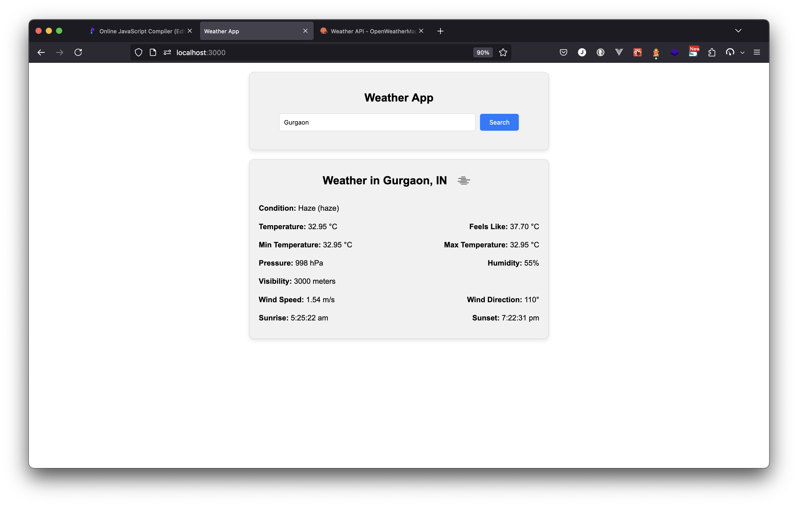

# Stentech Weather App

The Stentech Weather App is a simple, user-friendly application that provides current weather information based on the user's location or a specified city. The app fetches weather data from a public API and displays it in an intuitive interface.

## Features

- **Current Location Weather**: Automatically fetches and displays weather data for the user's current location.
- **Search by City**: Allows users to search for weather information by entering a city name.
- **Weather Details**: Provides detailed weather information including temperature, humidity, wind speed, and weather conditions.
- **Responsive Design**: Works seamlessly on both desktop and mobile devices.

## Technologies Used

- **Frontend**: HTML, CSS, JavaScript
- **API**: OpenWeatherMap API

## Getting Started

### Prerequisites

- Node.js and npm installed on your machine.
- An API key from OpenWeatherMap. You can get it [here](https://home.openweathermap.org/users/sign_up).

### Installation

1. Clone the repository:
   ```bash
   git clone https://github.com/thecryptoeditor/stentech-assessment.git
   cd stentech-assessment/stentech-weather-app

2. Install dependencies:

    ```
    npm install
    ```

3. Start the application:


    ```
    npm start
    ```



### All right reserved.